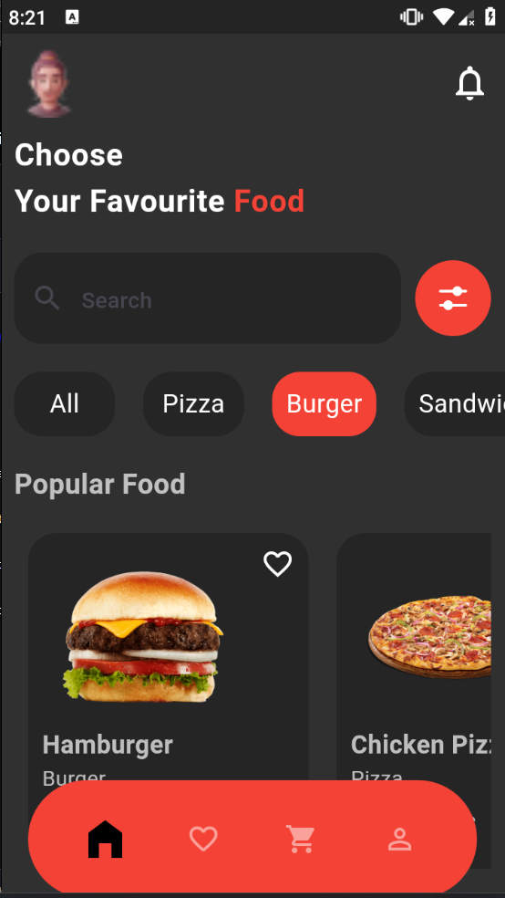

# 🍔 Food App UI
A modern and stylish Flutter-based Food App UI designed to showcase dynamic theming (light/dark mode), responsive design, and seamless navigation across pages. Perfect for food delivery apps, restaurant showcases, or your next Flutter project!

# ✨ Features

- 🌗 Dynamic Theming: Toggle between light and dark modes with real-time UI updates.
  
- 🍕 Interactive UI: Beautifully designed food categories and popular items sections.
  
- 📄 Details Page: Highlight individual food items with rich details and favorite toggling.
  
- 🛠️ Flutter BLoC Integration: Smooth state management with flutter_bloc.

# 🛠️ Built With
- Flutter: Framework for building cross-platform applications.
  
- Bloc: State management for dynamic and efficient UI updates.

# 📷 App Images

Below are sample images of the app in action. Add your screenshots here to display the app’s features effectively:

Home Page

